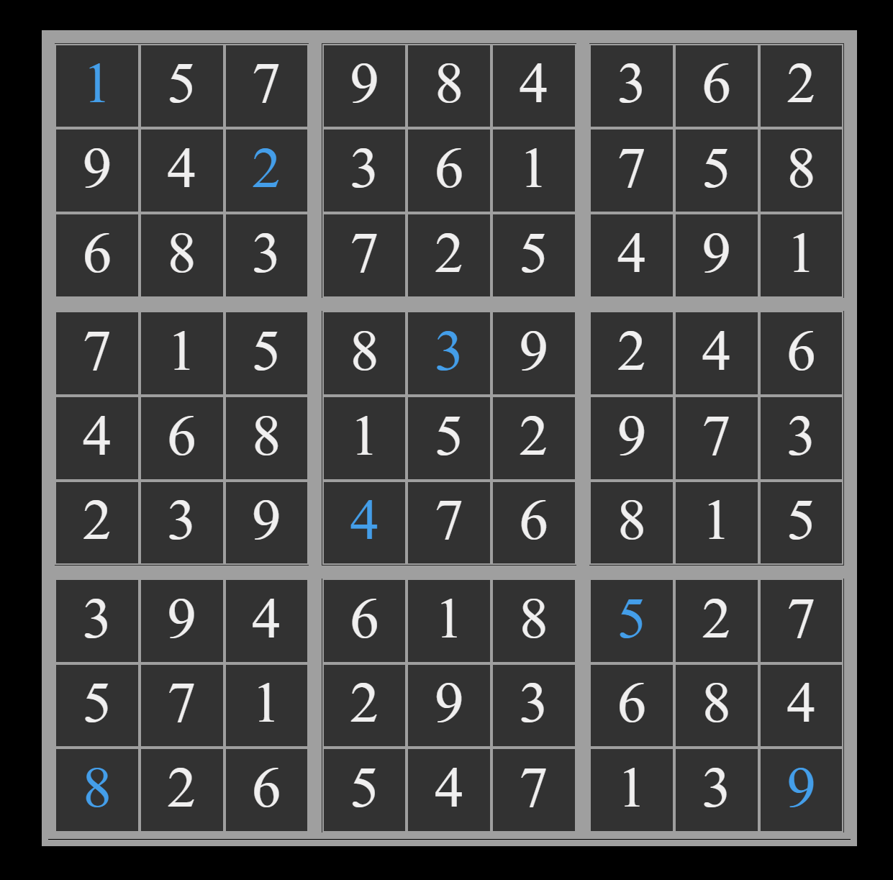

# Sudoku solver
A sudoku game solver. It solves _any_ Sudoku game. It implements an integer linear program to find a feasible solution given a set of initial constraints (_i.e._ starting numbers).

 
